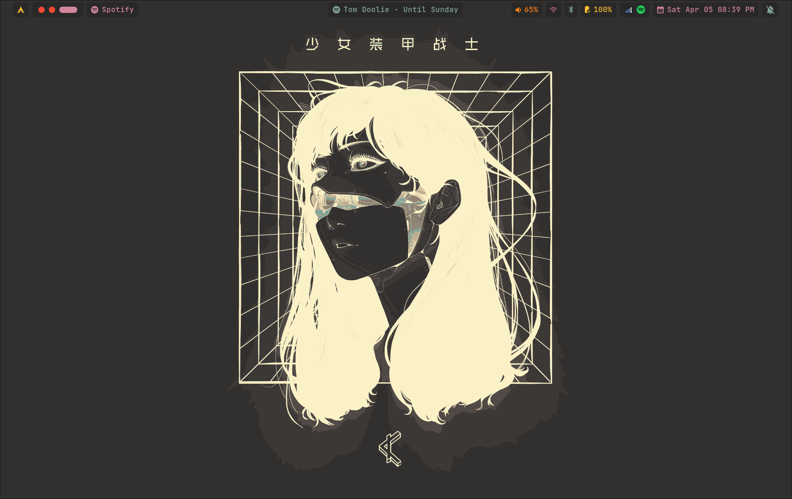
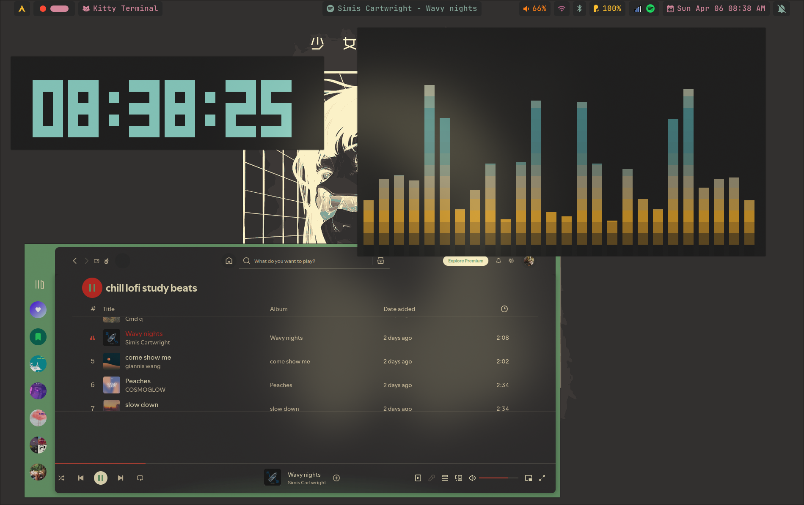

<h1 align="center">Hey, I'm Chetan 👋</h1>

🧠 16 y/o self-taught developer | Arch Linux user | C++ & Linux nerd

---

### 🛠️ About Me

- 🧑‍💻 Learning programming and building cool stuff.
- 💻 Daily driving **Arch Linux** with **Hyprland**.
- 🔧 I love tweaking systems, writing scripts, and exploring low-key dev tools.
- 🌱 Currently diving deeper into **C++**, **C**, and **Linux scripting**.
- 🚀 Trying to turn my skills into freelance gigs and real-world projects.

---

### 🧰 Tech Stack

---

### 📂 Projects I'm Proud Of

> 💡 These are small but mighty — scripts, tools, configs, and more.

- 🔧 [**Arch Rice Setup**](https://github.com/chetannnnnnnnnnnn/dot-files): My Hyprland + custom scripts setup.
- 🐚 [**Simple Shell in C++**](https://github.com/chetannnnnnnnnnnn/Shell-in-c): A basic shell built with C++, handling commands, pipes, and more.
- 📜 [**Learning Log**](https://github.com/chetannnnnnnnnnnn/learning-log): Notes, code, and experiments from my programming journey.

---

### 📈 GitHub Stats

  
   
  

---

### 💬 Let's Connect

- 🧠 Always learning, always building

---
 🖼️ My Hyprland Setup

  

  

Thanks for stopping by! 💻✨

